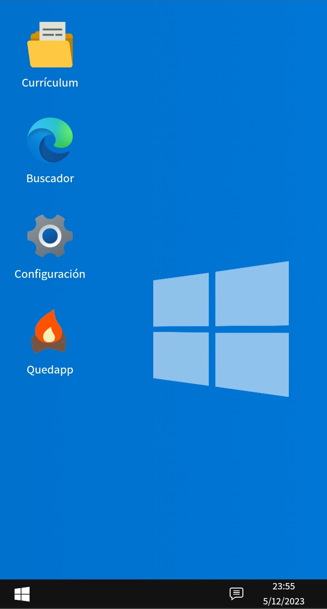

<h1 align="center">Portfolio Web Win10</h1>
<h3 align="center"> (Clon Windows 10) </h3>

  <p align="center">
    Emulación de la interfaz de windows 10 utilizando React y bun
    <h4 align="center"><a href="https://portfolio-antonio-corbalan.vercel.app/" target="_blank">LIVE DEMO</a></h4>
    <br />
  </p>
</div>

## Sobre el proyecto:

La interfaz de este portfolio imita la apariencia y algunas funcionalidades de windows 10.

Tecnologías usadas:
* React
* Javascript
* HTML
* CSS

En este proyecto no se ha utilizado ninguna librería que imite ya previamente la interfaz de Windows 10. Todos los componentes están estilados uno a uno utilizando únicamente CSS Modules.

## Getting Started

Si quieres utilizar este portfolio como template para hacer tu propia versión, te dejo aquí los comandos que necesitas para poder ejecutar la aplicación en local.

### Prerrequisitos

Necesitas tener NodeJS instalado en tu ordenador.
* Instalación en Linux:

  ```sh
  sudo apt update
  ```
  ```sh
  sudo apt install nodejs
  ```

### Instalación

Ejecuta los comandos en el orden indicado:

1. Abre una nueva terminal y clona el repositorio:
   ```sh
   git clone https://github.com/antoniocorbalannavvaro/friendly-computing-machine.git
   ```
2. Entra en la carpeta del proyecto:
   ```sh
   cd friendly-computing-machine
   ```
3. Instala los paquetes necesarios:
   ```sh
   npm i
   ```
4. Despliega el proyecto:
   ```sh
   npm run dev
   ```
5. Copia la URL en tu navegador:
   ```sh
   http://localhost:5173/
   ```

<p align="right">(<a href="#readme-top">back to top</a>)</p>


## Usos

Este código es completamente Open Source, así que puedes utilizarlo como mejor te convenga.


## Roadmap

- [x] Emular la interfaz de Windows 10.
- [x] Crear carpetas con información sobre mi perfil.
- [x] Añadir links directos a mis redes sociales.
- [x] Implementar botón de pantalla completa en las carpetas.
- [x] Implementar botón de minimizar carpetas.
- [x] Función Drag and Drop para las ventanas de contenido.
- [x] Versión responsive para móviles.
- [ ] Función Drag and Drop para los iconos del escritorio.
- [ ] Permitir crear carpetas nuevas y cambiarles el nombre.
- [ ] Implementar cambio de interfaz a MacOS.
- [ ] Añadir minijuegos.
- [-] Soporte para varios lenguajes:
    - [x] Español
    - [ ] Inglés
    - [ ] Francés

## Previsualización
<h1>Ordenador:


<h1>Móvil:
<h1 align="center"> Vertical:
<div style="display: flex;">



</div>

<h1 align="center"> Horizontal:


## Contacto

Antonio Corbalán Navarro - antoniocn1996@gmail.com

Project Link: [friendly-computing-machine](https://github.com/antoniocorbalannavvaro/friendly-computing-machine)

